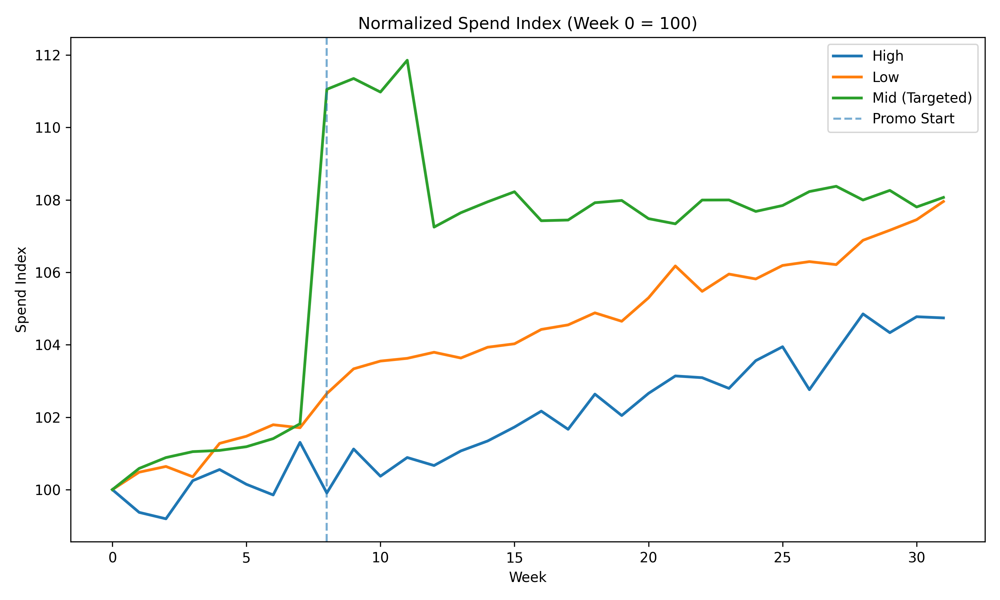
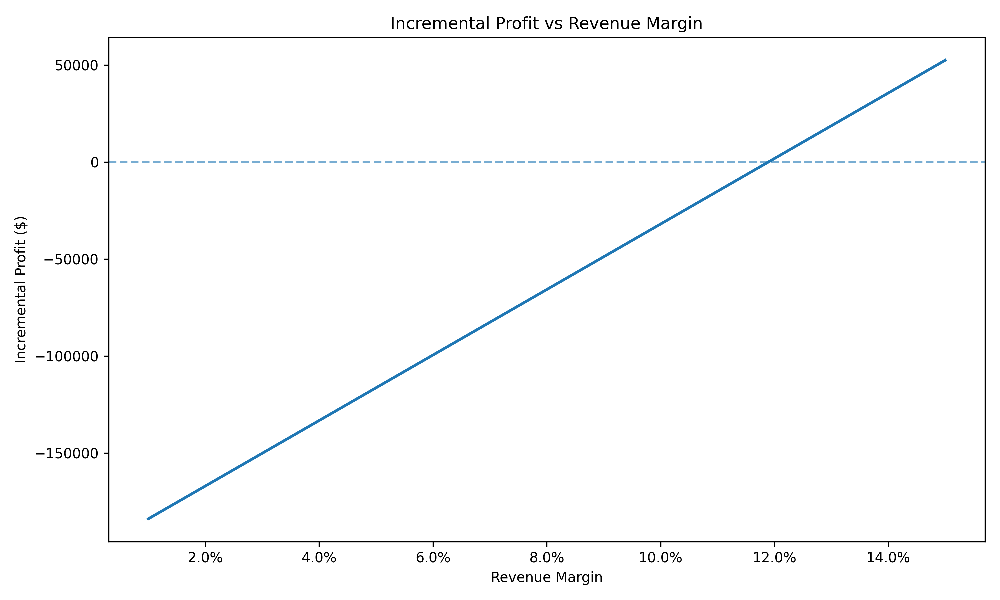
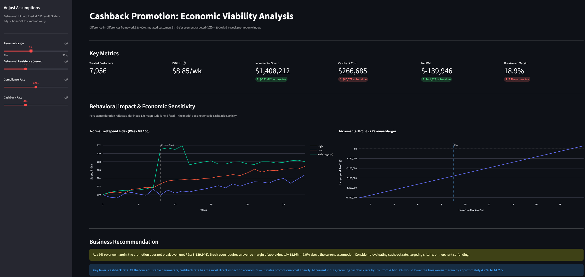

# Business Experimentation Case Study  
### Evaluating the Economic Viability of a Targeted Cashback Promotion

---

## Overview

This project simulates and evaluates a targeted cashback promotion using a Difference-in-Differences (DiD) framework.

The objective is to determine whether statistically significant behavioral lift translates into economic viability under realistic margin and cost assumptions.

The analysis integrates:

- Deterministic segment targeting
- Partial compliance (65%)
- Promotional lift (12%)
- Decaying behavioral persistence (20 weeks)
- Counterfactual modeling of incremental revenue
- Margin sensitivity analysis

---

## Experimental Design

- 20,000 simulated customers
- Right-skewed baseline spend distribution
- Mid-tier segment targeted (125–300 weekly spend)
- 4-week promotion window
- 20-week decaying persistence

Promotion applies 3% cashback to total treated spend.

---

## Behavioral Impact

Below is normalized spend by segment (Week 0 = 100):



Key observations:

- Parallel pre-trends across segments
- Clear mid-tier lift at promotion start
- Gradual behavioral decay after incentive removal
- No meaningful effect in non-targeted segments

The Difference-in-Differences estimate indicates statistically significant incremental lift (~$8.85 per treated customer per week, robust SE).

---

## Economic Evaluation

Incremental spend over 24 weeks: **~$1.69M**

Cashback cost (promo window only): **~$200K**

Even under a high-margin (6%) revenue scenario, the program remains economically negative.

Margin sensitivity:



Break-even revenue margin required: **~12%**

---

## Strategic Insight

This case highlights a critical experimentation principle:

> Statistical significance does not guarantee economic viability.

When promotional cost scales with total spend but revenue scales only with incremental lift, structural asymmetry emerges.

Profitability depends critically on:

- Margin structure
- Absolute lift magnitude
- Duration of sustained behavioral change
- Incentive design (caps, tiering, co-funding)

---

## Limitations

- Behavioral lift is treated as invariant to cashback rate. A real deployment would require an elasticity estimate from prior experiments or literature; none was available for this simulation.
- Compliance rate is modeled as a fixed parameter. In practice, compliance is likely correlated with spend tier and incentive magnitude.
- Customer independence is assumed. Network or social effects on spending behavior are not modeled.
- Behavioral persistence follows a pre-specified decay curve. Actual post-promotion decay would vary by customer segment and require holdout measurement.

---

## Interactive Dashboard

An interactive Streamlit dashboard allows assumption stress-testing without re-running the simulation.



Sidebar sliders adjust:
- Revenue margin
- Behavioral persistence duration
- Compliance rate
- Cashback rate

Charts and the recommendation block update live. The DiD lift estimate is held fixed — sliders recalculate the financial layer only.

```bash
streamlit run dashboard.py
```

---

## Project Structure

```
main.py
dashboard.py
src/
    config.py
    generate_data.py
    analysis.py
    finance.py
    visuals.py
    illustrative.py
docs/
    dashboard_screenshot.png
```

---

## How to Run

```bash
# Run simulation and generate figures (required before dashboard)
python main.py

# Launch interactive dashboard
streamlit run dashboard.py
```

---

## Technologies Used

- Python
- pandas, numpy, scipy
- statsmodels
- matplotlib, plotly
- streamlit

---

## Acknowledgements

Developed with [Claude Code](https://claude.com/claude-code) (Anthropic).
