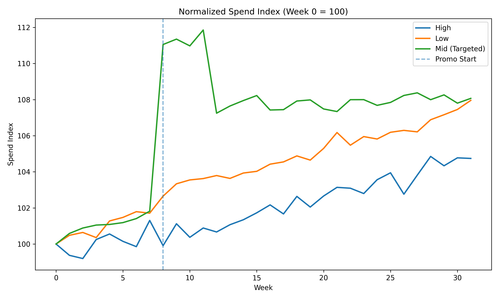
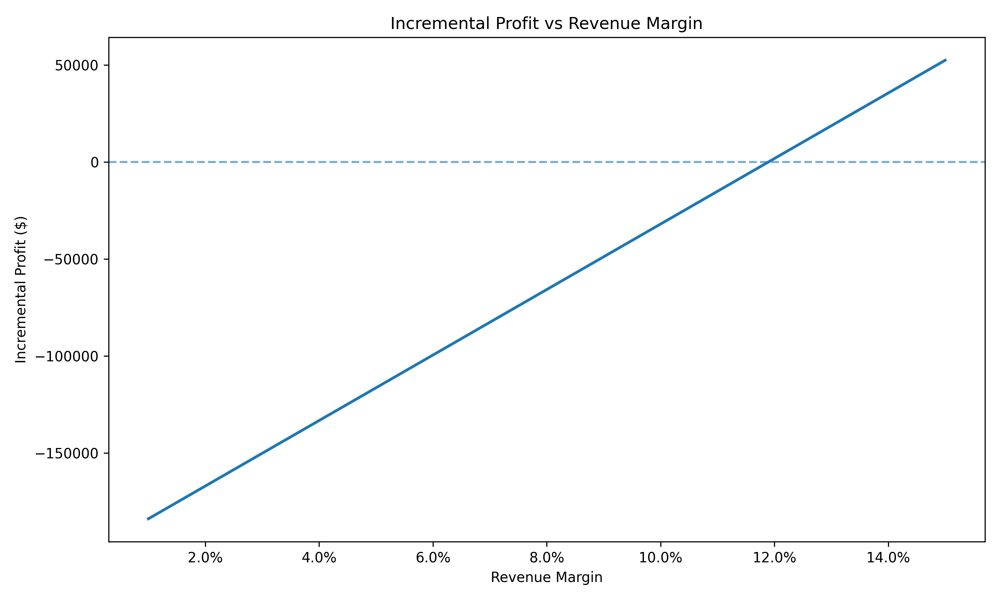
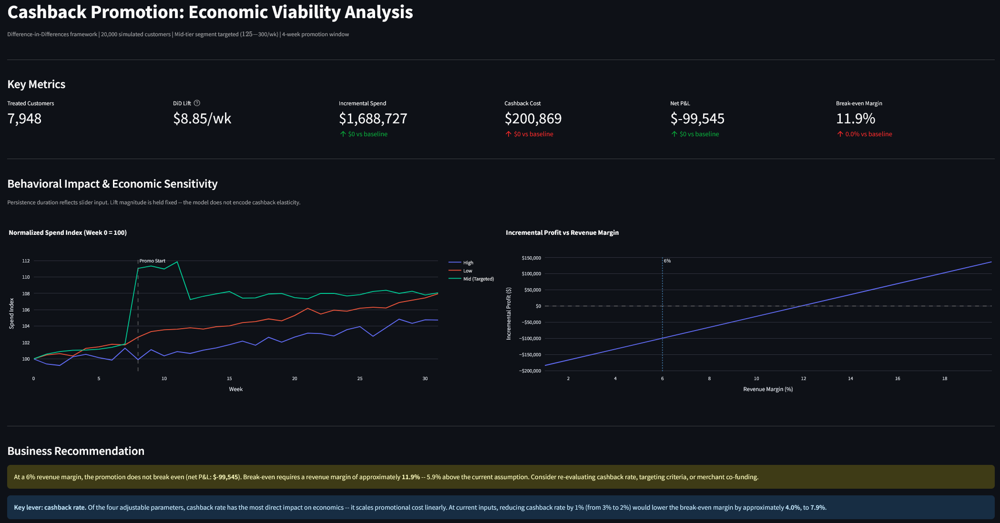

# Business Experimentation Case Study  
### Evaluating the Economic Viability of a Targeted Cashback Promotion

---

## Overview

This project simulates and evaluates a targeted cashback promotion using a Difference-in-Differences (DiD) framework.

The objective is to determine whether statistically significant behavioral lift translates into economic viability under realistic margin and cost assumptions.

The analysis integrates:

- Deterministic segment targeting
- Partial compliance (65%)
- Promotional lift (12%)
- Decaying behavioral persistence (20 weeks)
- Counterfactual modeling of incremental revenue
- Margin sensitivity analysis

---

## Experimental Design

- 20,000 simulated customers
- Right-skewed baseline spend distribution
- Mid-tier segment targeted (125–300 weekly spend)
- 4-week promotion window
- 20-week decaying persistence

Promotion applies 3% cashback to total treated spend.

---

## Behavioral Impact

Below is normalized spend by segment (Week 0 = 100):



Key observations:

- Parallel pre-trends across segments (in percentage terms; see Ground-Truth Validation for why this matters)
- Clear mid-tier lift at promotion start
- Gradual behavioral decay after incentive removal
- No meaningful effect in non-targeted segments

The Difference-in-Differences estimate indicates statistically significant incremental lift (~$8.85 per treated customer per week, robust SE).

---

## Economic Evaluation

Incremental spend over 24 weeks: **~$1.69M**

Cashback cost (promo window only): **~$200K**

Even under a high-margin (6%) revenue scenario, the program remains economically negative.

Margin sensitivity:



Break-even revenue margin required: **~12%**

---

## Ground-Truth Validation

Because the data is simulated, the true causal effect is knowable. `src/validation.py` re-runs the simulation with identical random seeds but the promotion switched off; the difference in treated spend is exactly what the promotion caused.

| Measure | $ / treated customer / week |
|---|---|
| DiD estimate | 8.85 |
| **True causal lift** | **5.91** |
| Bias (DiD on the no-promotion panel) | 2.94 |
| &nbsp;&nbsp;from regression-to-mean drift | 1.97 |
| &nbsp;&nbsp;from level trends + selection | 0.97 |

**DiD overstates the true lift by ~50%.** For a 2x2 DiD the decomposition is exact (`DiD = true lift + placebo DiD`), and the pipeline asserts it on every run.

Two sources of bias:

- **Regression-to-mean drift.** The simulation applies a 1% post-period upward drift to every treated customer. It is indistinguishable from a treatment effect, so DiD absorbs it.
- **Non-parallel trends in levels.** The macro trend is multiplicative, so higher-spending treated customers gain more *dollars* than control even with identical *percentage* growth. The normalized chart above shows parallel trends in percentages; the regression runs in dollars. Selecting the treated group on noisy pre-period spend adds a small mean-reversion component.

**Implication:** the business conclusion strengthens. At the true lift, break-even margin rises from ~12% to **~18%**. The headline figures above are kept as the DiD estimate because that is what an analyst would observe without ground truth — which is the point. In a real deployment, a log-spend specification or a randomized holdout within the targeted segment would remove most of this bias.

---

## Strategic Insight

This case highlights a critical experimentation principle:

> Statistical significance does not guarantee economic viability.

When promotional cost scales with total spend but revenue scales only with incremental lift, structural asymmetry emerges.

Profitability depends critically on:

- Margin structure
- Absolute lift magnitude
- Duration of sustained behavioral change
- Incentive design (caps, tiering, co-funding)

---

## Limitations

- Behavioral lift is treated as invariant to cashback rate. A real deployment would require an elasticity estimate from prior experiments or literature; none was available for this simulation.
- Compliance rate is modeled as a fixed parameter. In practice, compliance is likely correlated with spend tier and incentive magnitude.
- Customer independence is assumed. Network or social effects on spending behavior are not modeled.
- Behavioral persistence follows a pre-specified decay curve. Actual post-promotion decay would vary by customer segment and require holdout measurement.
- The DiD estimate is biased upward by ~50% relative to the simulation's ground truth (see Ground-Truth Validation). Reported economics use the DiD estimate, so they are optimistic.
- The dashboard scales a single pooled average lift linearly with persistence weeks. Because the true lift decays, shortening persistence understates the average weekly lift slightly.

---

## Interactive Dashboard

An interactive Streamlit dashboard allows assumption stress-testing without re-running the simulation.



Sidebar sliders adjust:
- Revenue margin
- Behavioral persistence duration
- Compliance rate
- Cashback rate

Charts and the recommendation block update live. The DiD lift estimate is held fixed — sliders recalculate the financial layer only.

```bash
streamlit run dashboard.py
```

---

## Project Structure

```
main.py                   # runs simulation, analysis, validation; writes outputs/
dashboard.py              # Streamlit app
src/
    config.py             # all simulation and financial parameters
    generate_data.py      # customer panel simulation
    analysis.py           # DiD regression and diagnostics
    finance.py            # incremental revenue vs. cashback cost
    validation.py         # ground-truth check of the DiD estimate
    illustrative.py       # dashboard financial layer (reads simulation_results.json)
    visuals.py            # matplotlib (static) and Plotly (dashboard) charts
tests/
    test_illustrative.py
outputs/
    simulation_results.json
    figures/
docs/
    dashboard_screenshot.png
```

---

## How to Run

```bash
# Set up environment
python -m venv .venv
.venv\Scripts\activate          # Windows; use `source .venv/bin/activate` on macOS/Linux
python -m pip install -r requirements.txt

# Run simulation, analysis, and validation; regenerates figures and results JSON
python main.py

# Launch interactive dashboard
streamlit run dashboard.py

# Run tests
python -m pytest
```

Committed outputs let the dashboard run on a fresh clone; `main.py` regenerates them deterministically (seed 42).

---

## Technologies Used

- Python
- pandas, numpy, scipy
- statsmodels
- matplotlib, plotly
- streamlit
- pytest

---

## Acknowledgements

Developed with [Claude Code](https://claude.com/claude-code) (Anthropic).

## License

MIT -- see [LICENSE](LICENSE).
